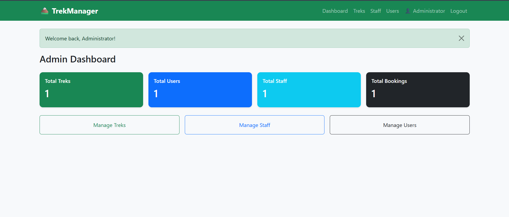
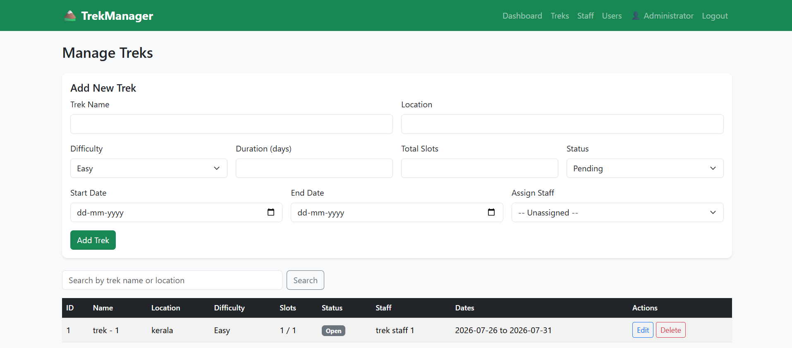
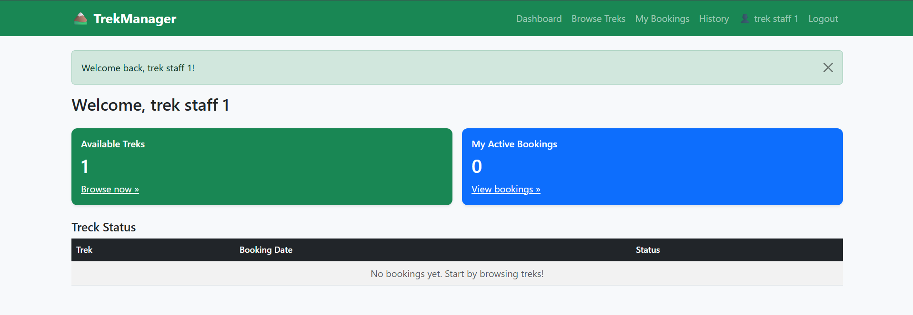
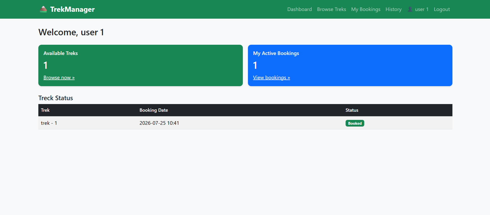

# Trekking Management System

A web-based trekking management application developed using Flask that provides a platform for managing treks, bookings, users, and trekking staff.

The application supports role-based access for administrators, trekking staff, and trekkers, with different functionalities available for each user role.

## Features

### Admin
- Manage registered users
- Manage trekking staff
- Create and manage treks
- View booking information
- Monitor trekking activities

### Trekker
- Register and log in to the application
- Browse available treks
- View trek details
- Book available treks
- View personal booking history

### Trek Staff
- Log in using staff credentials
- View assigned treks
- Access relevant trek and participant information

## Technologies Used

**Backend**
- Python
- Flask
- Flask-SQLAlchemy
- Flask-Login

**Frontend**
- HTML
- CSS
- Bootstrap
- Jinja2

**Database**
- SQLite / SQLAlchemy


## Installation

1. Clone the repository:

```bash
git clone <repository-url>
```

2. Navigate to the project directory:

```bash
cd trekking-management-app
```

3. Install the required packages:

```bash
py -m pip install -r requirements.txt
```

4. Run the application:

```bash
py app.py
```

5. Open the local address displayed in the terminal in your browser.

## Screenshots







## Future Improvements

- Improved trek recommendation system
- Email notifications for bookings
- Enhanced analytics dashboard
- Improved security and authentication
- Deployment to a cloud platform

## Author

**Jai K Bharghav Prasanna**